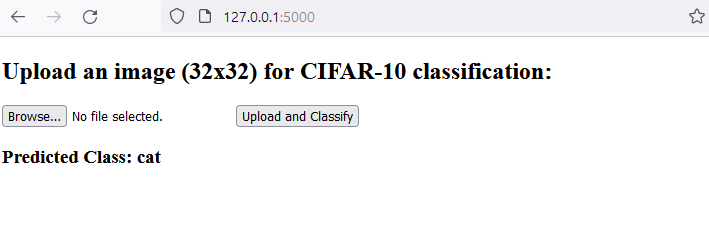

# CNN-ImagePredictor-CIFAR10
This project provides a web-based image classifier application, leveraging a Convolutional Neural Network (CNN) trained on the CIFAR-10 dataset. The application is implemented using Flask and TensorFlow.

## Features 
- Web-based interface for uploading images.
- Real-time image classification using a trained CNN.
- Uses the CIFAR-10 dataset categories: ['airplane', 'automobile', 'bird', 'cat', 'deer', 'dog', 'frog', 'horse', 'ship', 'truck'].

## Installation & Setup
```
pip install flask numpy tensorflow Pillow

```
## Model Training
- The CNN model is trained on the CIFAR-10 dataset using TensorFlow.
- The trained model is saved as cifar10_model.h5 for inferencing in the web application.

## Usage
1. Run the Flask application:
```
python app.py

```
2. Open a web browser and navigate to http://127.0.0.1:5000/.
3. Use the interface to upload and classify images based on the CIFAR-10 dataset categories.

## How It Works


Input Photo

